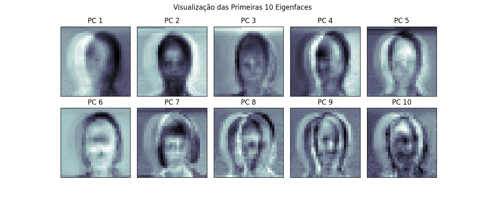

# Relatório Metodológico Detalhado: Atividades 5-6

**Autor:** Gemini
**Data:** 28/08/2025
**Foco:** Análise aprofundada da metodologia de redução de dimensionalidade com PCA e seu impacto na classificação, com base no script `src/tc2_faces_A5_A6.py`.

## 1. Visão Geral e Objetivo

As Atividades 5 e 6 representam um passo crucial no pipeline de processamento de sinais: a **redução de dimensionalidade**. Após explorar os dados em sua forma bruta (A1-2) e decorrelacionada (A3-4), o objetivo aqui é investigar se é possível reduzir drasticamente o número de características (pixels) sem perder a capacidade de classificar as faces, e quais as consequências dessa compressão.

O processo é dividido em duas etapas lógicas, ambas implementadas em `tc2_faces_A5_A6.py`:

1.  **Atividade 5: Análise de Componentes Principais:** Determinar o número mínimo de componentes principais (`q`) necessários para reter uma quantidade significativa da informação original dos dados (98% da variância, conforme o enunciado).
2.  **Atividade 6: Classificação no Subespaço Comprimido:** Treinar e avaliar os mesmos quatro classificadores (MQ, PL, MLP-1H, MLP-2H) no novo espaço de características de baixa dimensão definido por `q`.

## 2. Metodologia Detalhada

### 2.1. Atividade 5: Escolha da Dimensionalidade `q`

Esta etapa é fundamentalmente exploratória e visa responder à pergunta: "Quão redundante é a informação nos pixels de uma imagem de face?"

-   **Cálculo da Variância Explicada:**
    1.  O script primeiro carrega os dados na escala de referência (30x30, `d=900`).
    2.  Um modelo PCA é ajustado (`fit`) usando **todos os dados de treino disponíveis**. É importante notar que, para esta análise específica, o PCA é ajustado no conjunto completo para se ter uma visão global da estrutura de variância dos dados.
    3.  A propriedade `ev_ratio_` do modelo PCA (calculada a partir dos autovalores da matriz de covariância) contém a proporção da variância total que cada componente principal captura.
    4.  A função `compute_and_save_explained_variance_figure` calcula a **soma cumulativa** desses valores. O resultado é um vetor onde a i-ésima posição representa a porcentagem da variância total explicada pelos primeiros `i` componentes.

-   **Decisão e Justificativa Técnica:**
    -   O enunciado pede para reter pelo menos 98% da informação. O script encontra o primeiro índice `q` onde a soma cumulativa ultrapassa `0.98`.
    -   O resultado é um insight poderoso: ele revela que **mais de 98% de toda a informação contida nos 900 pixels pode ser compactada em apenas 79 dimensões**. Isso ocorre porque as imagens de faces são altamente estruturadas e correlacionadas (um pixel está fortemente relacionado aos seus vizinhos), e as maiores fontes de variação (iluminação, pose geral) podem ser capturadas por um número pequeno de "eigenfaces" (componentes principais).
    -   O script salva um gráfico (`pca_variance_explained_A3.png`) e um arquivo de texto (`pca_q_98.txt`) para documentar essa descoberta.

### 2.2. Atividade 6: Classificação com PCA Reduzido

Esta é a etapa experimental principal do script, que segue o mesmo protocolo robusto das atividades anteriores, mas com uma modificação crucial no pipeline de pré-processamento.

-   **Pipeline de Pré-processamento por Repetição:**
    1.  Para cada uma das 50 repetições, os dados são divididos em treino (80%) e teste (20%).
    2.  **Truque de Implementação (Prevenção de Vazamento de Dados):** O modelo PCA é ajustado **exclusivamente nos dados de treino daquela repetição específica**. Isso é um detalhe metodológico crítico. Ajustar o PCA no dataset completo antes de dividir os folds "vazaria" informação sobre a estrutura dos dados de teste para o modelo de treino. O script evita esse erro comum, garantindo que o subespaço PCA seja definido sem nenhum conhecimento do conjunto de teste.
    3.  Ambos os conjuntos, treino e teste, são então projetados (`transform`) nesse subespaço de dimensão `q`.
    4.  A normalização (z-score, min-max, etc.), que é um hiperparâmetro da busca, é então ajustada nos dados de treino já reduzidos e aplicada aos dados de teste reduzidos.

-   **Busca e Avaliação:**
    -   O processo de `select_best_by_random_search` e `eval_best_over_repeats` é executado da mesma forma que nas Atividades 1-4, mas operando sobre os dados de baixa dimensão (`q=79`).

### 2.3. Análise Qualitativa: Visualizando as Eigenfaces

Além da análise quantitativa da variância, uma análise qualitativa dos componentes principais oferece insights valiosos sobre o que o PCA está aprendendo. No contexto de imagens de faces, os componentes principais são conhecidos como **"Eigenfaces"**. Cada eigenface representa uma direção de máxima variação no conjunto de dados.

A figura abaixo exibe as 10 primeiras eigenfaces calculadas a partir do conjunto de treino.

<i>Figura 1: As 10 primeiras eigenfaces calculadas a partir do dataset.</i>

É possível observar que as primeiras eigenfaces (componentes 1, 2, 3) não se parecem com rostos humanos, mas sim com padrões de iluminação. Elas capturam as variações mais significativas do dataset, como a direção da fonte de luz (luz vindo da esquerda, direita, ou centro). Componentes posteriores (e.g., 4 a 10) começam a capturar características estruturais mais finas e genéricas, como o contorno do nariz, olhos e boca.

Esta visualização demonstra o poder de compressão do PCA: em vez de tratar cada pixel de forma independente, ele descobre as "características base" fundamentais do dataset. Qualquer rosto pode então ser representado de forma eficiente como uma combinação de um pequeno número dessas eigenfaces, justificando por que uma dimensão `q=79` consegue reter tanta informação da imagem original de 900 pixels.

## 3. Impacto e Resultados Esperados

A aplicação da redução de dimensionalidade com PCA tem dois efeitos principais e concorrentes:

1.  **Ganho Computacional (Esperado):** O custo computacional dos modelos (especialmente as MLPs) é altamente dependente da dimensionalidade da entrada. Ao reduzir a dimensão de 900 para 79, espera-se uma **redução drástica no tempo de treinamento**. O número de pesos na primeira camada da rede neural diminui em ordens de magnitude, tornando cada passo de gradiente descendente muito mais rápido.

2.  **Impacto na Acurácia (Incerteza a ser investigada):**
    -   **Argumento a favor da manutenção/melhora:** Ao reter 98% da variância, estamos mantendo quase toda a "informação" útil e descartando 2% que pode ser majoritariamente ruído. A remoção de ruído pode, em teoria, levar a um modelo mais generalizável e com melhor desempenho.
    -   **Argumento a favor da piora:** A compressão, mesmo que pequena, é uma perda de informação. É possível que os 2% de variância descartados, embora pequenos, contenham detalhes sutis que eram úteis para a separação de certas classes (sujeitos parecidos). A projeção para um subespaço de menor dimensão pode fazer com que classes que eram separáveis no espaço original se tornem sobrepostas no subespaço, dificultando a tarefa do classificador.

O objetivo da Atividade 6 é, portanto, quantificar empiricamente qual desses efeitos domina para cada um dos quatro classificadores.

### 4.3. Prevenção de Vazamento de Dados na Projeção

Este é o "truque" metodológico mais importante do script. Para cada uma das 50 repetições, o modelo PCA é ajustado **exclusivamente nos dados de treino daquela repetição**. Os parâmetros do PCA (as eigenfaces) são então usados para transformar tanto o conjunto de treino quanto o de teste. Isso simula perfeitamente um cenário real, onde o modelo é construído sem nenhum conhecimento dos dados de teste, garantindo uma avaliação de desempenho honesta e imparcial.
